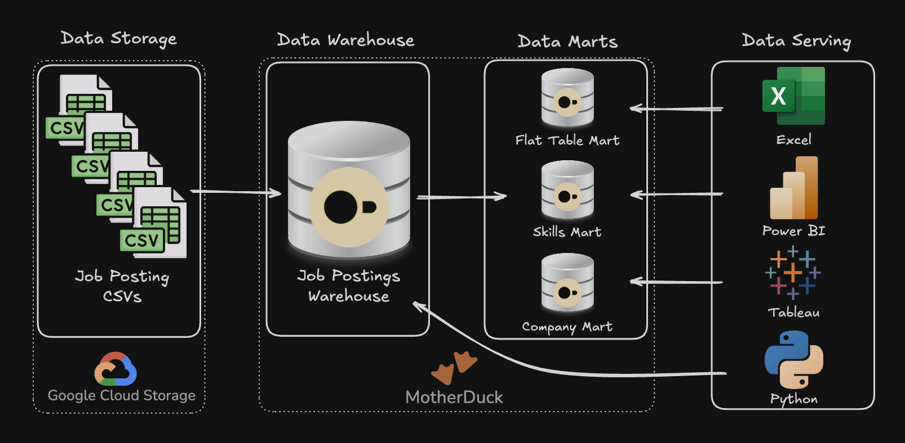

# Data Engineering Projects

Two complementary projects demonstrating SQL analytics and data engineering pipeline development.

# Projects

## [1_EDA](./1_EDA/) - Exploratory Data Analysis

SQL-driven analysis of data engineer job market trends using advanced querying techniques.

**Skills**: Complex joins, aggregations, analytical functions, data quality validation

### [2_WH_Mart_Build](./2_WH_Mart_Build/) - Data Pipeline - Data Warehouse & Mart

End-to-end ETL pipeline transforming raw CSV files into a star schema data warehouse and analytical data marts.

**Skills**: Dimensional modeling, ETL pipeline development, data mart architecture, production practices
