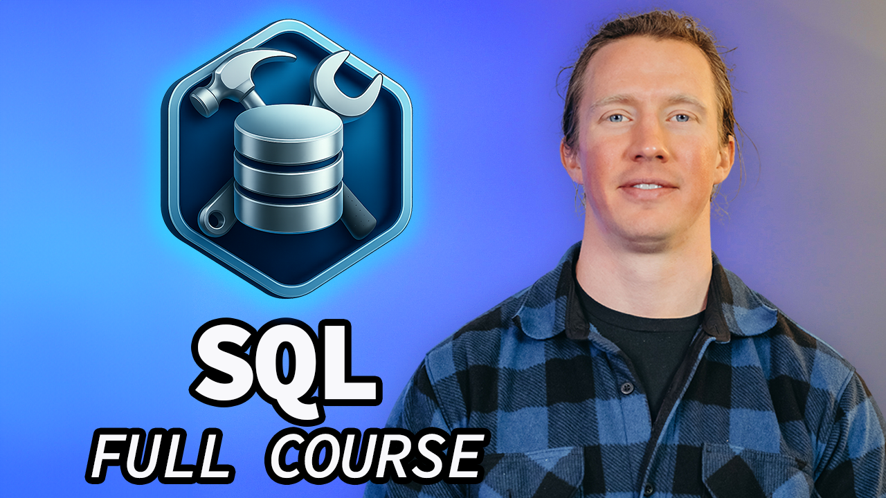

# 🛠️ SQL for Data Engineering - Full Course

Data Nerds! This repo contains all the files needed to follow along my free course: SQL for Data Engineering

[Support the course and get a bonus practice problems and course certificate!](https://www.lukebarousse.com/sql-de)

## Special Thanks 🙌

  

A special thanks to [SerpAPI](https://serpapi.com/), whose generous credits made it possible to gather the job postings data used in this course.

If you're interested in using SerpAPI for your own data projects, [sign up here](https://serpapi.com/) and mention **Luke sent you** to get an additional **20% OFF** off paid plans!

## Team Members 👥
**🙋🏼‍♂️ Course Leader:** [Luke Barousse](https://www.linkedin.com/in/luke-b)  
**🎬 Course Producer:** [Kelly Adams](https://www.linkedin.com/in/kellyjianadams)  
**💻 Content Developer:** [Rikki Singh](https://www.linkedin.com/in/rikkisingh)  
**📺 Video Editor:** [Brannon Linder](https://www.linkedin.com/in/brannonlinder)  

## Table of Contents

TODO: Fill in table of contents once course is built

## How to Run SQL Files

TODO: Add instructions for how to run the SQL files.

## Found a Typo? Want to Contribute?
- If you find an error in this repo, please feel free to make a pull request by:
    - Forking the repo
    - Making any changes
    - Submitting a pull request