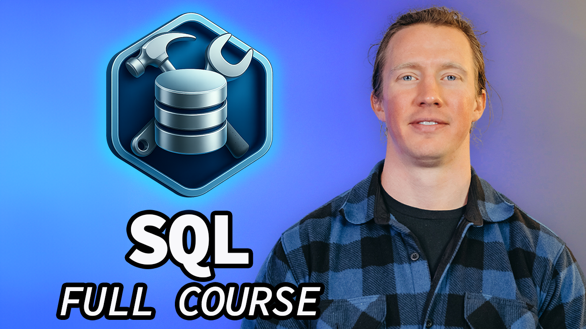

# 🛠️ SQL for Data Engineering - Full Course

Data Nerds! This repo contains all the files needed to follow along my free course: SQL for Data Engineering

[Support the course and get a bunch of perks](https://www.lukebarousse.com/courses/sql-for-data-engineering)

## Special Thanks 🙌

  

This course wouldn't have been possible without [SerpAPI](https://serpapi.com/), who generously provided the credits necessary to pull the job postings data used throughout this course. Without their support, the comprehensive dataset that powers all the SQL examples and projects simply wouldn't exist.

If you're interested in using SerpAPI for your own data projects, [sign up here](https://serpapi.com/) and mention **Luke sent you** to get an additional **20% OFF** on paid plans!

## Team Members 👥
**🙋🏼‍♂️ Course Leader:** [Luke Barousse](https://www.linkedin.com/in/luke-b)  
**🎬 Course Producer:** [Kelly Adams](https://www.linkedin.com/in/kellyjianadams)  
**💻 Content Developer:** [Rikki Singh](https://www.linkedin.com/in/rikkisingh)  
**📺 Video Editor:** [Brannon Linder](https://www.linkedin.com/in/brannonlinder)  

## Table of Contents

TODO: Fill in table of contents once course is built

## How to Run SQL Files

TODO: Add instructions for how to run the SQL files.

## Found a Typo? Want to Contribute?
- If you find an error in this repo, please feel free to make a pull request by:
    - Forking the repo
    - Making any changes
    - Submitting a pull request